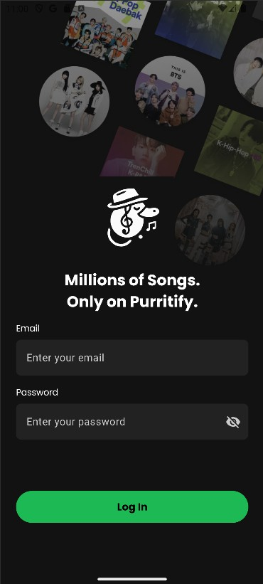
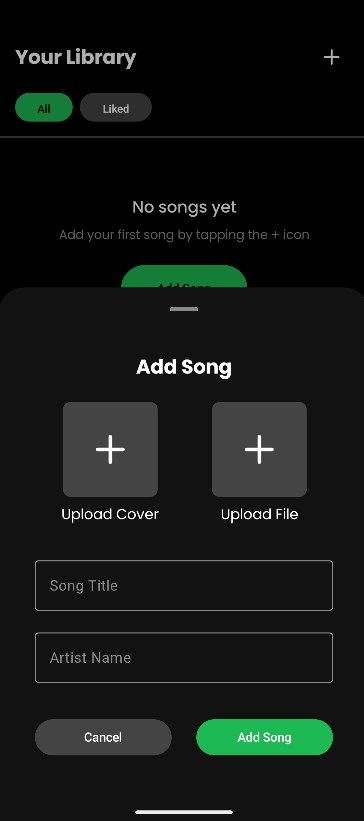

# Purrytify

Purrytify adalah aplikasi pemutar musik. Aplikasi ini memungkinkan pengguna untuk login, logout, memutar lagu, menyukai lagu, menambah lagu baru, serta mengelola profil pengguna. Selain itu, Purrytify juga dilengkapi dengan fitur background service dan network sensing untuk memberikan pengalaman mendengarkan yang lebih nyaman dan responsif terhadap koneksi internet.

---

## Teknologi & Library

| Library | Fungsi |
|--------|--------|
| `androidx.compose.*` | Framework utama untuk UI deklaratif modern |
| `androidx.lifecycle.viewmodel.compose` | Integrasi ViewModel dalam Compose |
| `androidx.activity.compose` | Menjalankan Compose dalam `Activity` |
| `androidx.navigation.compose` | Navigasi antar composable screens |
| `androidx.material3` | Material Design 3 components |
| `androidx.material.icons.extended` | Material icons yang lengkap untuk UI |
| `androidx.palette.ktx` | Mengambil warna dominan dari gambar album untuk tema dinamis |
| `coil.compose` | Image loader ringan dan Compose-friendly |
| `glide` | Image loading dan caching (opsional, untuk kebutuhan non-Compose) |
| `retrofit` | HTTP client untuk komunikasi API |
| `converter.gson` | Konversi otomatis JSON ↔ data class |
| `gson` | Library parsing JSON dari Google |
| `androidx.datastore.preferences` | Pengganti modern untuk SharedPreferences |
| `room` | Abstraksi database SQLite modern dan coroutine-friendly |
| `ksp` | Kompilasi kode Room via Kotlin Symbol Processing (KSP) |

---

## Screenshot Aplikasi

### Login Screen

### Home (Daftar Lagu)

### Library

### User Profile

### Add Song 

---

## Pembagian Kerja Anggota Kelompok

| Nama Anggota           | NIM           | Tugas                                                                 |
|------------------------|---------------|------------------------------------------------------------------------|
| Satriadhikara Panji Yudhistira           | 13522125   | Home Page, Login Page, Profile Page, add song  |
| Mohammad Andhika Fadillah       | 13522128    | Login Page, Profile Page, Track View |
| Farrel Natha Saskoro            | 13522145    | Library, Mini Player, Home Page, Track View |

---

## Estimasi Jam Pengerjaan

| Nama Anggota      | Jam Persiapan | Jam Pengerjaan | 
|-------------------|----------------|----------------|
| Satriadhikara Panji Yudhistira      | 1 jam          | 6 jam         | 
| Mohammad Andhika Fadillah  | 2 jam          | 6 jam         | 
| Farrel Natha Saskoro       | 2 jam          | 6 jam         | 

---
