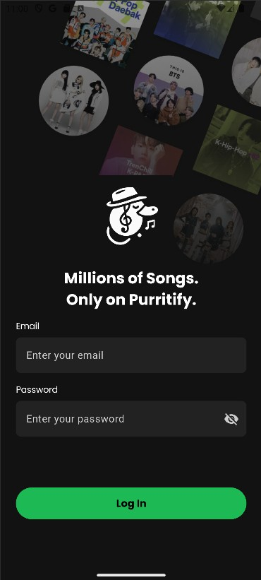
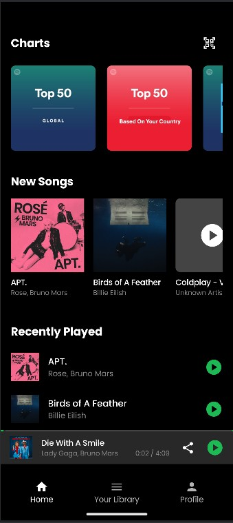
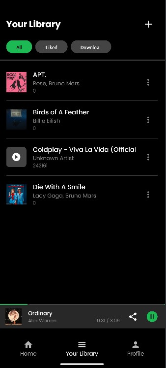
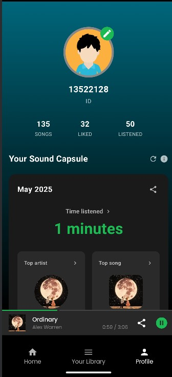
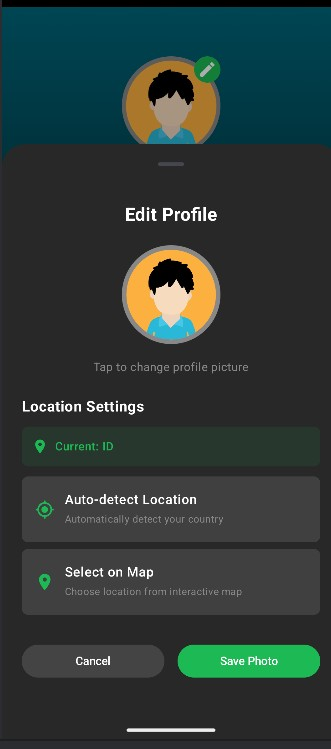
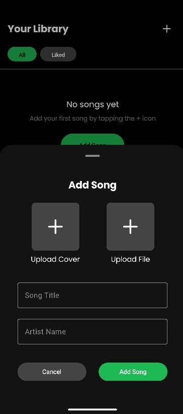
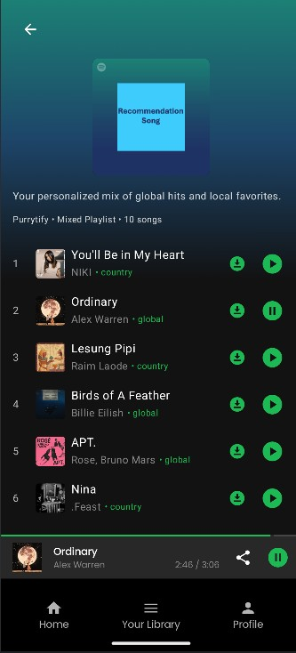
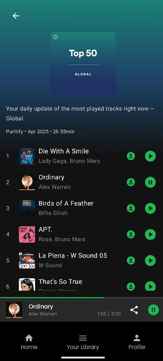
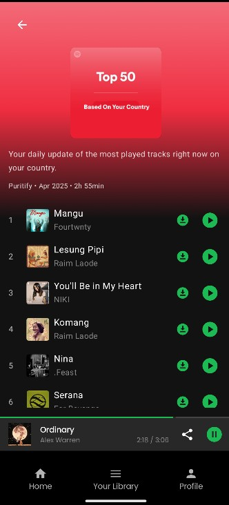

# Purrytify

**Purrytify** adalah aplikasi pemutar musik pintar yang dirancang untuk memberikan pengalaman mendengarkan musik yang personal, fleksibel, dan menyenangkan. Aplikasi ini memungkinkan pengguna untuk login, logout, memutar lagu, menyukai lagu, menambah lagu baru, serta mengelola profil pengguna. Selain itu, Purrytify juga dilengkapi dengan fitur background service dan network sensing untuk memberikan pengalaman mendengarkan yang lebih nyaman dan responsif terhadap koneksi internet. Dengan dukungan fitur online song, offline downloads, analitik, serta kontrol penuh melalui notifikasi dan routing audio, Purrytify membawa pengalaman mendengarkan musik ke level yang lebih tinggi.

##  Fitur Utama

###  Online Songs
- Menampilkan **Top 50 Global** dan **Top 10 Lagu Berdasarkan Negara**.
- Metadata lengkap: cover, judul, artis, durasi.
- Pemutaran langsung dari server.

###  Download Lagu
- Lagu dari server dapat diunduh ke perangkat.
- Lagu yang diunduh otomatis masuk ke tab download pada **Your Library** dan dapat diputar secara offline.

###  Sound Capsule
- Menampilkan:
  - Total durasi mendengarkan per bulan
  - Artis dan lagu terfavorit
  - Day-Streak mendengarkan lagu
- Data analitik dapat diekspor ke **CSV atau PDF**.
- Menampilkan status "No data available" jika data belum ada.

###  Notification Controls
- Kontrol lagu langsung dari notifikasi dan lock screen.
- Tersedia tombol Play, Pause, Next, Prev.
- Tampilkan mini cover art, judul, dan artis lagu yang sedang diputar.

###  Audio Routing
- Memilih output device (contoh: speaker Bluetooth, headset).
- Deteksi otomatis perangkat yang tersedia.
- Fallback otomatis ke speaker internal saat koneksi hilang.

###  Share Songs
- Lagu dari server bisa dibagikan via:
  - **URL Deep Link**
  - **QR Code**
- Mendukung Android ShareSheet.
- Validasi link QR untuk memastikan keaslian tautan.

### 📐 Responsiveness
- Mendukung **portrait dan landscape mode** di tampilan.
- Tampilan UI adaptif di berbagai ukuran layar.

###  Edit Profile
- Mengubah profil pengguna, termasuk lokasi dan foto.
- Lokasi dapat dipilih otomatis (akses GPS) atau manual via Maps.

### 💡 Rekomendasi Lagu
- Menampilkan rekomendasi lagu berdasarkan top songs global dan top song based on country

---

## Teknologi & Library

| Library | Fungsi |
|--------|--------|
| `androidx.compose.*` | Framework utama untuk UI deklaratif modern |
| `androidx.lifecycle.viewmodel.compose` | Integrasi ViewModel dalam Compose |
| `androidx.activity.compose` | Menjalankan Compose dalam `Activity` |
| `androidx.navigation.compose` | Navigasi antar composable screens |
| `androidx.material3` | Material Design 3 components |
| `androidx.material.icons.extended` | Material icons yang lengkap untuk UI |
| `androidx.palette.ktx` | Mengambil warna dominan dari gambar album untuk tema dinamis |
| `coil.compose` | Image loader ringan dan Compose-friendly |
| `glide` | Image loading dan caching (opsional, untuk kebutuhan non-Compose) |
| `retrofit` | HTTP client untuk komunikasi API |
| `converter.gson` | Konversi otomatis JSON ↔ data class |
| `gson` | Library parsing JSON dari Google |
| `androidx.datastore.preferences` | Pengganti modern untuk SharedPreferences |
| `room` | Abstraksi database SQLite modern dan coroutine-friendly |
| `ksp` | Kompilasi kode Room via Kotlin Symbol Processing (KSP) |

---

## Screenshot Aplikasi

### Login Screen

### Home (Daftar Lagu)

### Library

### User Profile

### Edit User Profile

### Add Song 

### Recommendation Song

### Top 50 Song Global

### Top Songs Based on Country

### Trackview

---

## Pembagian Kerja Anggota Kelompok

| Nama Anggota           | NIM           | Tugas                                                                 |
|------------------------|---------------|------------------------------------------------------------------------|
| Satriadhikara Panji Yudhistira           | 13522125   | Home Page, Login Page, Profile Page, add song, sound capsule, edit profile  |
| Mohammad Andhika Fadillah       | 13522128    | Login Page, Profile Page, Track View, online songs, download online songs, rekomendasi lagu|
| Farrel Natha Saskoro            | 13522145    | Library, Mini Player, Home Page, Track View, notification control, AudioRouting and Output Device, share song via url, share song via qr|

---

## Estimasi Jam Pengerjaan (MileStone 1)

| Nama Anggota      | Jam Persiapan | Jam Pengerjaan | 
|-------------------|----------------|----------------|
| Satriadhikara Panji Yudhistira      | 1 jam          | 6 jam         | 
| Mohammad Andhika Fadillah  | 2 jam          | 6 jam         | 
| Farrel Natha Saskoro       | 2 jam          | 6 jam         | 

---

## Estimasi Jam Pengerjaan (MileStone 2)

| Nama Anggota      | Jam Persiapan | Jam Pengerjaan | 
|-------------------|----------------|----------------|
| Satriadhikara Panji Yudhistira      | 10 jam          | 30 jam         | 
| Mohammad Andhika Fadillah  | 10 jam          | 30 jam         | 
| Farrel Natha Saskoro       | 10 jam          | 30 jam         | 

---
